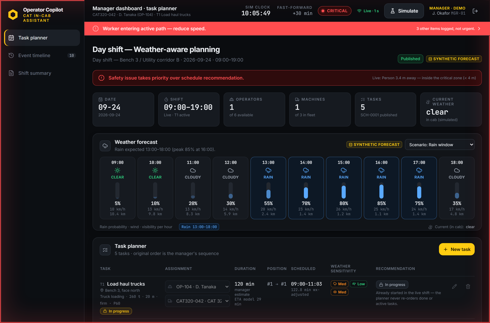
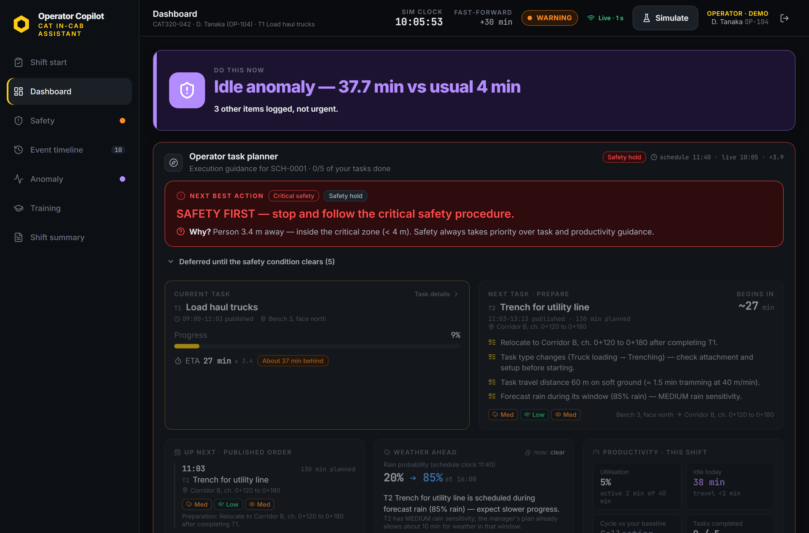
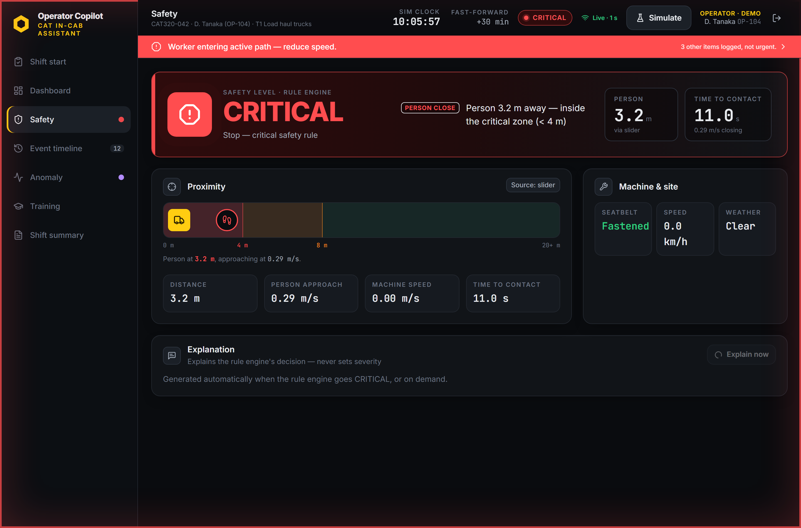
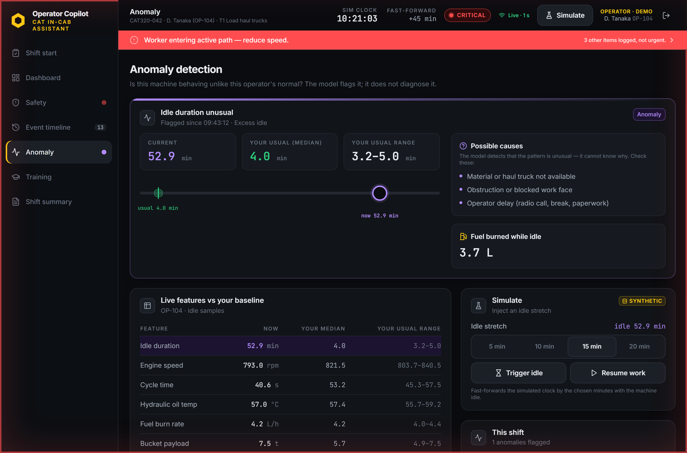
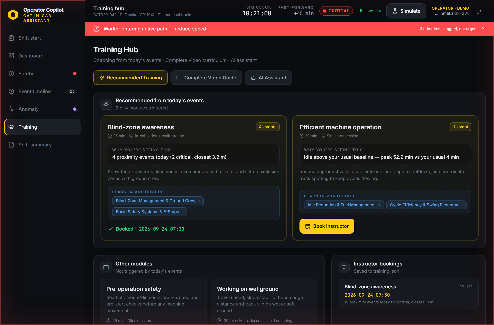
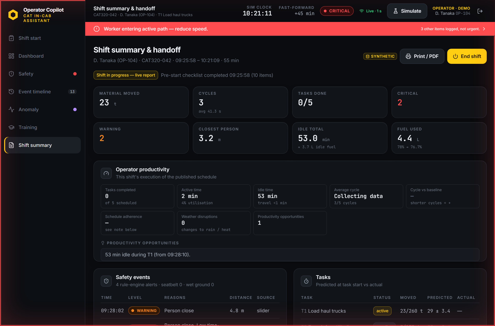

# CAT Operator Copilot

An explainable, event-driven in-cab AI assistant and weather-aware dispatch planner designed for heavy-equipment operators and site managers. It actively detects safety hazards, identifies machine anomalies, provides transparent next-best-action guidance, updates task completion ETAs in real-time, and transforms shift incidents into personalised operator training — all without requiring the operator to take their hands off the controls.

> **Note on Data:** All machine telemetry, task histories, operator profiles, and weather forecasts are synthetically generated by `backend/simulator.py` to reflect realistic open-pit mining and earthmoving conditions. The UI transparently labels synthetic data throughout.

---

## Key Feature Screenshots

| **Weather-Aware Shift Planner (Manager)** | **In-Cab Operator Copilot (Operator)** |
| :---: | :---: |
| [](docs/screenshots/01_manager_weather_planner.png) | [](docs/screenshots/02_operator_copilot_dashboard.png) |
| *Hourly synthetic weather modeling, rain/wind hazard windows, sensitivity profiles, and automated schedule re-sequencing.* | *One clear actionable headline, deterministic priority ranking, live task progress, and ± 3.4 min held-out ETA error band.* |

| **Proximity Safety & Dynamic Danger Zones** | **Machine Anomaly Detection & Baselines** |
| :---: | :---: |
| [](docs/screenshots/03_safety_proximity.png) | [](docs/screenshots/04_anomaly_detection.png) |
| *YOLOv8 vision detection, closing-speed calculations, time-to-contact (TTC), and instant SAFE/WARNING/CRITICAL rule states.* | *Dual-state IsolationForest, operator-specific median/IQR comparisons, idle fuel tracking, and root cause hints.* |

| **Event-Driven Personalised Training** | **Shift Summary & Productivity Handoff** |
| :---: | :---: |
| [](docs/screenshots/05_personalized_training.png) | [](docs/screenshots/06_shift_summary.png) |
| *Automated curriculum recommendations derived directly from today's logged events, video modules, and instructor booking.* | *Complete shift roll-up, safety event logs, cycle productivity observations, fuel consumption, and operator handoff notes.* |

---

## Core Idea & Philosophy

Heavy-equipment operations in mining and construction demand maximum situational awareness under high cognitive load. Traditional in-cab screens overwhelm operators with alarms, gauges, and complex telematics dashboards.

**CAT Operator Copilot solves this through five foundational pillars:**

1. **Unambiguous In-Cab Focus (The "One Headline" Rule):**
   When multiple events occur simultaneously (e.g., seatbelt unfastened, idle spike, task delay, and worker approach), the system suppresses clutter and surfaces exactly **one top-priority action** calculated using a deterministic scoring formula. Other items are quietly auto-logged.
2. **Safety Rule Engine as Trust Anchor:**
   The Large Language Model (LLM) **never** decides severity or priority rankings. Critical safety boundaries and alarm transitions are strictly governed by transparent, deterministic physics rules (`backend/safety.py`).
3. **Factual, Grounded Explanations:**
   When an operator requests an explanation (or when an event reaches `CRITICAL`), the assistant provides concise, facts-only context. If the LLM generates any metric not present in the computed telemetry payload, the system falls back instantly to a deterministic template.
4. **Proactive Weather-Aware Planning:**
   Instead of reacting to rain delays after machines get stuck in mud, site managers can preview weather impacts and run a deterministic list-scheduling heuristic that re-sequences rain-sensitive tasks (e.g., fine road grading) ahead of storms, saving critical shift minutes.
5. **Continuous Operator Development:**
   Real shift infractions (e.g., proximity breaches, extended idle cycles, steep grade travel) automatically convert into targeted training recommendations and video refresher modules.

---

## System Architecture

```
┌────────────────────────────────────────────────────────────────────────────────────────┐
│                        FRONTEND (React + Vite + Tailwind CSS)                          │
│   • In-Cab Dark Industrial Theme (High-contrast, large touch targets, glare-resistant) │
│   • Manager Dashboard (/manager) · Operator Copilot (/dashboard) · Safety (/safety)    │
│   • Anomaly Telemetry (/anomaly) · Training Hub (/training) · Shift Handoff (/summary) │
└──────────────────────────────────────────┬─────────────────────────────────────────────┘
                                           │ Polling: GET /api/state (1 Hz)
                                           ▼
┌────────────────────────────────────────────────────────────────────────────────────────┐
│                        BACKEND CORE ENGINE (FastAPI / Python)                          │
│   • 1 Hz Global Background Engine Tick (`backend/main.py`)                             │
│   • Thread-safe state synchronisation & live telemetry event streaming                │
└────┬────────────┬────────────┬─────────────┬─────────────┬─────────────┬─────────────┬─┘
     │            │            │             │             │             │             │
     ▼            ▼            ▼             ▼             ▼             ▼             ▼
┌──────────┐ ┌──────────┐ ┌──────────┐ ┌──────────┐ ┌──────────┐ ┌──────────┐ ┌──────────┐
│LiveSim & │ │Safety &  │ │Priority  │ │Vision &  │ │Anomaly   │ │ETA Model │ │Claude LLM│
│Telemetry │ │Rules     │ │Ranker    │ │Proximity │ │Detector  │ │(Random   │ │& Template│
│Simulator │ │Engine    │ │(Heuristic│ │(YOLOv8n  │ │(Isolation│ │ Forest)   │ │Fallback  │
│          │ │          │ │ formula) │ │ + Proxy) │ │ Forest)  │ │          │ │          │
└──────────┘ └──────────┘ └──────────┘ └──────────┘ └──────────┘ └──────────┘ └──────────┘
     │            │            │             │             │             │             │
     └────────────┴────────────┴─────────────┼─────────────┴─────────────┴─────────────┘
                                             ▼
             ┌─────────────────────────────────────────────────────────────────┐
             │            WEATHER-AWARE & DISPATCH SUBSYSTEM                   │
             │   • `weather.py`: Synthetic hourly forecasts & hazard windows   │
             │   • `planner.py`: Sensitivity profiles & list-scheduling engine │
             │   • `schedule_clock.py`: Live-shift to published-order mapping  │
             │   • `operator_planner.py`: Next-Best-Action guidance engine     │
             │   • `operator_metrics.py`: Productivity analysis & cycle stats  │
             └─────────────────────────────────────────────────────────────────┘
```

### Component Breakdown

- **Determinism First (`safety.py` & `priority.py`):**
  Safety levels (`SAFE`, `WARNING`, `CRITICAL`) use hard physical constants: warning distance $D_{\text{warn}} = 8\,\text{m}$, critical distance $D_{\text{crit}} = 4\,\text{m}$, warning time-to-contact $T_{\text{warn}} = 4\,\text{s}$, critical time-to-contact $T_{\text{crit}} = 2\,\text{s}$, and maximum wet-ground travel speed $V_{\text{wet}} = 1.5\,\text{km/h}$.
  The alert prioritization formula evaluates:
  $$\text{Score} = \text{Severity} \times \text{Time-to-Harm} \times \text{Confidence} \times \text{Context}$$
- **Computer Vision Subsystem (`vision.py`):**
  Accepts frames from cab webcams or simulated streams. Runs lightweight YOLOv8n to identify persons. Computes an uncalibrated distance proxy $d = K / h$ (where $h$ is bounding box height fraction and $K=1.6$) and derives closing speed vectors to project time-to-contact.
- **Anomaly Detection Subsystem (`anomaly.py`):**
  Maintains two separate scikit-learn `IsolationForest` models trained on 14,000+ historical machine cycles: one for working states (trenching/loading) and one for idle states. Flags anomalies only when scores drop below the 5th percentile for $\ge 3$ consecutive seconds. Pairs machine flags with operator-specific historical median and interquartile range (IQR) baselines.
- **Machine Learning Task ETA Subsystem (`eta.py`):**
  `RandomForestRegressor` trained on synthetic task logs across machine tonnage, cycle duration, distance, terrain, and weather conditions. Accompanying every live prediction is the real, held-out Mean Absolute Error ($\pm 3.4\,\text{min}$) so operators understand model uncertainty.
- **Explainability Engine (`ai.py`):**
  Generates 3-sentence operational summaries using Claude (via Anthropic API). An internal validation checker ensures every number in the LLM response is strictly present in the verified facts JSON; otherwise, it swaps to a deterministic template fallback in $< 1\,\text{ms}$.
- **Weather-Aware Planning & Heuristic Resequencing (`planner.py`):**
  Integrates hourly precipitation, wind velocity, and visibility penalties:
  $$\text{Penalty} = W_{\text{rain}} \cdot 0.6 \cdot P(\text{rain}) + W_{\text{wind}} \cdot 0.5 \cdot \text{Severity}_{\text{wind}} + W_{\text{vis}} \cdot 0.4 \cdot \text{Severity}_{\text{vis}}$$
  Dynamically reorders tasks without violating dependencies, earliest-start constraints, or manager override pins.

---

## Key Features

### 1. In-Cab Live Copilot & Next Best Action

The operator dashboard provides high-contrast, distraction-free in-cab guidance engineered specifically for heavy equipment cabs. It computes a single actionable headline, suppresses non-critical noise, and projects live task completion times with explicit model uncertainty bounds.


- **One Headline Display:** Highlights the single most pressing operational or safety issue while quietly queueing non-urgent events into a timeline.
- **Operator Task Guidance:** Step-by-step preparation alerts (e.g., *"Prepare for haul truck arrival in 4 min"*, *"Attachment change required for trenching"*).
- **Live ETA with Uncertainty Bands:** Real-time completion forecasts with explicit held-out error tolerances ($\pm 3.4\,\text{min}$).
- **Counterfactual ETA Tracking:** Explains exact delay causes (e.g., *"ETA changed by +16 min because machine was idle for 16 min"*).

---

### 2. Proximity Safety & Dynamic Exclusion Zones

Deterministic safety monitoring tracks workers and site personnel in real time using YOLOv8 computer vision and dynamic physics-based closing vectors. The rule engine enforces immediate stops without relying on black-box LLM decisions.


- **Real-Time Bounding & Tracking:** Multi-zone safety awareness (Safe $> 8\,\text{m}$, Warning $4\text{--}8\,\text{m}$, Critical $< 4\,\text{m}$).
- **Time-to-Contact (TTC) Dynamic Calculations:** Projects collision risk factoring in both machine velocity and human approach vectors.
- **Dual-Input Flexibility:** Operates seamlessly via live camera feed or an interactive distance/speed simulation slider.
- **Hysteresis & Anti-Flicker:** Prevents UI jitter through a 2-second downgrade hold period while ensuring instant upgrades to `CRITICAL`.

---

### 3. Machine Telemetry & Anomaly Detection

Real-time health monitoring compares current machine telemetry (hydraulic oil temperature, engine speed, fuel burn rate, and cycle duration) against both global fleet models and the assigned operator's own historical baselines.


- **State-Aware Isolation Forests:** Decouples working cycles from idle cycles to eliminate false alarms during normal warm-up periods.
- **Personalized Operator Baselines:** Compares live metrics against the current operator's own historical median and IQR.
- **Idle Fuel Cost Analysis:** Quantifies fuel wastage during extended idle stretches using real burn-rate metrics ($4.2\,\text{L/h}$).

---

### 4. Weather-Aware Schedule Optimization (Manager Portal)

The manager dashboard equips site dispatchers with hourly meteorological forecasts, sensitivity modeling, and a deterministic list-scheduling heuristic that reshuffles weather-sensitive tasks into dry windows.


- **Hourly Meteorological Hazard Mapping:** Visualizes rain windows, wind gusts, and visibility drops.
- **List-Scheduling Heuristic:** Evaluates task weather sensitivity (Low / Med / High) and shifts vulnerable operations into dry windows.
- **Manager Overrides & Manual Pinning:** Preserves human command authority with drag/pin overrides and one-click schedule publishing.
- **Live Shift Re-sequencing:** Re-plans only pending tasks while strictly locking active or completed work.

---

### 5. Event-Driven Personalised Training Hub

Incidents, near-misses, and operational inefficiencies logged during the shift are automatically mapped to tailored micro-learning modules, video guides, and simulator coaching sessions.


- **Direct Event-to-Curriculum Mapping:** Proximity incidents recommend *Blind-Zone Awareness*, excess idle triggers *Fuel Optimization*, and wet tramming triggers *Traction Control*.
- **Integrated Video Curriculum & AI Assistant:** Operator coaching modules with detailed walkthroughs and interactive Q&A.
- **Instructor Session Booking:** Operators can schedule 1-on-1 field coaching directly from the cab.

---

### 6. Shift Handoff & Productivity Reporting

At the close of each shift, the copilot compiles a comprehensive handoff report capturing total tonnage moved, safety compliance records, idle fuel consumption, and non-punitive productivity opportunities.


- **Automated Summary Roll-up:** Consolidates material moved, total cycles, idle time, safety violations, and fuel consumed.
- **Factual Productivity Observations:** Highlights cycle opportunities objectively without punitive rankings.
- **Digital Shift Notes:** Allows outgoing operators to record handover notes for incoming shifts.

---


## How to Run Locally

### Prerequisites

- **Python 3.10+** (with virtual environment recommended)
- **Node.js 18+** & **npm**

### Quick Start (Single-Command Production Mode)

The backend is configured to host the compiled frontend production build directly on port `8000`:

```bash
# 1. Clone repository
git clone https://github.com/TanishqDaga/operator-copilot.git
cd operator-copilot

# 2. Build the frontend
cd frontend
npm install
npm run build
cd ..

# 3. Setup Python backend
python -m venv venv
# On Windows:
.\venv\Scripts\activate
# On Linux/macOS:
# source venv/bin/activate

pip install -r backend/requirements.txt

# 4. Start the server (serves both API and UI)
python -m uvicorn main:app --app-dir backend --port 8000
```
Open **[http://localhost:8000](http://localhost:8000)** in your browser.

---

### Development Mode (Hot Reload)

For active frontend and backend development:

```bash
# Terminal 1: Backend API (port 8000)
.\venv\Scripts\activate
python -m uvicorn main:app --app-dir backend --port 8000 --reload

# Terminal 2: Frontend Dev Server (port 5173, auto-proxies /api to 8000)
cd frontend
npm install
npm run dev
```
Open **[http://localhost:5173](http://localhost:5173)** in your browser.

---

### Optional Configurations

Create a `.env` file in the root directory (or set environment variables):

```bash
# Optional: Enable Claude LLM Explanations (defaults to template fallback if omitted)
ANTHROPIC_API_KEY="your-api-key-here"
COPILOT_LLM_MODEL="claude-opus-5"

# Optional: Real webcam person detection
# Requires: pip install ultralytics opencv-python-headless
# Pretrained yolov8n.pt will automatically download on first execution.
```

### Running Test Suite

```bash
python -m pytest backend/tests -v
```

---

## Interactive Demo Walkthrough

Use the in-app **Simulate** drawer (top-right of any screen) to trigger synthetic operational events:

1. **Sign In (`/login`):** Select **Manager** or choose an **Operator** (e.g., `D. Tanaka`).
2. **Shift Pre-Start (`/start`):** Review the 10-point walk-around safety checklist and begin the shift.
3. **Flagship Multi-Signal Alert:**
   - In the Simulate drawer, click **Flagship: five signals at once**.
   - Notice that while seatbelt, idle, ETA delay, approaching worker, and training items trigger at once, the dashboard displays only:  
     `Worker entering active path — reduce speed. (4 other items logged, not urgent.)`
4. **Proximity Safety Escalation (`/safety`):**
   - Click **Walk-in** or drag the distance slider from $20\,\text{m} \to 3.4\,\text{m}$.
   - Watch the state escalate instantly from `SAFE` $\to$ `WARNING` $\to$ `CRITICAL`.
   - Click **Explain** to view the auto-generated factual explanation.
5. **Weather-Aware Optimization (`/manager`):**
   - View the synthetic rain hazard (13:00–18:00, peak 85% rain).
   - Click **Generate weather-aware plan** to see rain-sensitive tasks moved into clear windows.
   - Click **Publish schedule** to push the sequence directly to the operator's in-cab planner.
6. **Machine Idle Spike (`/anomaly`):**
   - Trigger a 15-minute simulated idle stretch.
   - Observe the Isolation Forest flag and comparison against the operator's median baseline.
7. **End Shift & Handoff (`/summary`):**
   - Review total material moved, safety infractions, and fuel burned.
   - Submit shift notes and conclude the operator's shift.

---

## Data & Formula Traceability

| Metric / Action | Source & Calculation Method |
|---|---|
| **Headline Priority** | $\text{Score} = \text{severity} \times \text{time-to-harm} \times \text{confidence} \times \text{context}$ via `backend/priority.py`. |
| **Safety Thresholds** | Fixed physics constants in `backend/safety.py`: $D_{\text{warn}}=8\,\text{m}$, $D_{\text{crit}}=4\,\text{m}$, $T_{\text{warn}}=4\,\text{s}$, $T_{\text{crit}}=2\,\text{s}$, $V_{\text{wet}}=1.5\,\text{km/h}$. |
| **Time to Contact (TTC)** | $\text{TTC} = \frac{\text{Distance}}{\max(\text{Machine Speed} + \text{Approach Speed},\, 0.1\,\text{m/s})}$. |
| **Vision Distance Proxy** | $d = K / \text{box\_height}$ ($K=1.6$, explicitly labeled as an uncalibrated proxy in the UI). |
| **ETA Uncertainty ($\pm$)** | Held-out Mean Absolute Error ($3.4\,\text{min}$) of `RandomForestRegressor` (`models/eta.joblib`). |
| **Counterfactual ETA** | Re-prediction comparing baseline parameters with delta adjustments (e.g. idle duration directly increments task finish time). |
| **Anomaly Score** | `IsolationForest` score falling below the 5th percentile quantile threshold for $\ge 3$ consecutive seconds. |
| **Operator Baseline** | Operator-specific median and interquartile range (IQR) calculated from 14,000+ historical cycles in equivalent machine states. |
| **Idle Fuel Wastage** | $\text{Wasted Fuel (L)} = \text{Idle Minutes} \times \frac{4.2\,\text{L/h (historical mean idle burn)}}{60}$. |
| **Weather Time Saved** | $\sum \text{Adjusted Duration (Original)} - \sum \text{Adjusted Duration (Optimized)}$. |

---

## API Reference

| Method | Endpoint | Purpose |
|---|---|---|
| `GET` | `/api/state` | Core telemetry and machine state feed polled at 1 Hz |
| `GET` | `/api/alerts` | Active prioritized alerts (`{headline, quiet, quiet_count, items}`) |
| `GET` | `/api/tasks` | Current shift tasks, live ETAs, and held-out error metrics |
| `GET` | `/api/events` | Historical shift event log (persisted in `data/events.json`) |
| `GET` | `/api/meta` | Operators, machines, safety constants, model metrics, and presets |
| `POST` | `/api/sim` | Trigger synthetic actions (`move_worker`, `trigger_idle`, `weather`, `pace`, etc.) |
| `POST` | `/api/explain` | Generate factual event explanation via Claude LLM or deterministic template |
| `GET` | `/api/summary` | Complete shift roll-up, productivity observations, and handoff data |
| `POST` | `/api/shift/start` | Validate checklist and initiate operator shift |
| `POST` | `/api/shift/end` | Close active shift and finalize performance metrics |
| `POST` | `/api/vision/frame` | Process camera frame using YOLOv8 person detector |
| `GET` | `/api/planner` | Fetch tasks, weather forecast, original vs recommended schedule (Manager) |
| `POST` | `/api/planner/recommend` | Generate weather-aware schedule recommendation |
| `POST` | `/api/planner/publish` | Publish finalized schedule for operators |
| `GET` | `/api/operator/planner` | Operator Next-Best-Action guidance and task sequence (Read-only) |
| `GET` | `/api/training` | Fetch personalized training curriculum and event-linked modules |
| `POST` | `/api/training/book` | Book practical session with instructor |

---

## License

Built for the Caterpillar Hackathon. All rights reserved.
